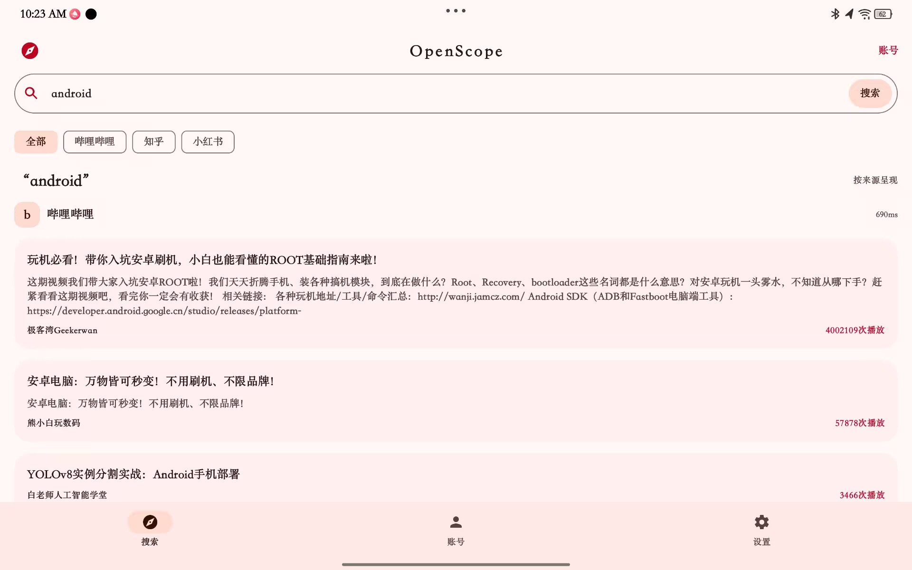
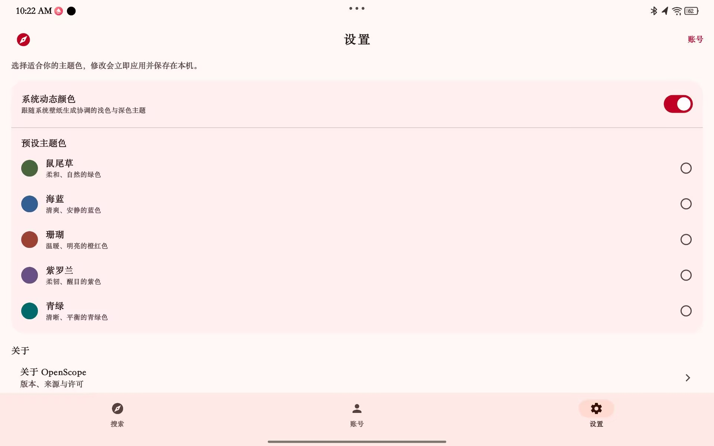
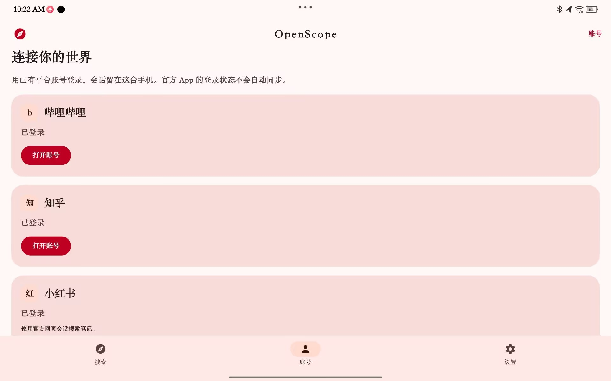

# OpenScope Android

Kotlin + Jetpack Compose + Material 3 聚合搜索验证项目，面向 Bilibili、知乎、小红书。用户已有平台账号，通过 App 内官方 WebView 登录；不依赖官方 App 自动共享会话，不需要 PC、Termux 或 root。

## Contributors

- [metaMMY07](https://github.com/metaMMY07) — Android implementation and release integration
- [KellenGO](https://github.com/KellenGO) — MediaCrawler project collaboration

本 Android 客户端源自 [KellenGO/MediaCrawler](https://github.com/KellenGO/MediaCrawler) 的聚合搜索方向；现以 OpenScope 形式独立发布。上游非商业学习许可证及平台使用边界仍然适用，详见 `app/src/main/assets/licenses/MediaCrawler-LICENSE.txt`。

## 界面预览

| 搜索 | 设置 | 账号 |
| --- | --- | --- |
|  |  |  |

## 最新公开版本：v0.1.1

GitHub Release：[OpenScope Android v0.1.1](https://github.com/metaMMY07/MediaCrawler/releases/tag/v0.1.1)。侧载测试包：[OpenScope-0.3.0-arm64-v8a.apk](https://github.com/metaMMY07/MediaCrawler/releases/download/v0.1.1/OpenScope-0.3.0-arm64-v8a.apk)，10,434,637 bytes（10.43 MB），versionCode 3。APK 内部 versionName 保留为 0.3.0；使用内部测试 debug 签名，可覆盖安装。

本轮将应用改名为 OpenScope，移除好问题 hero 与建议内容。搜索列表每个平台初始显示 3 条，More 每次优先从已加载缓冲追加 3 条；返回搜索列表会保存滚动位置。Bilibili 的状态文案统一为未登录和已登录，不再把未登录状态标成匿名或宣称无需登录。

账号 scope 扫描、官方验证和凭证指纹持久化已经接入；仅凭 cookie 存在不能宣称已登录。小红书改走官方网页 DOM 搜索路线，不移植私有签名；修复 `search_result` 跳到 HTTP 导致白屏的问题，升级为 HTTPS 并保留查询参数，正确返回未登录状态并展示 App 内登录入口。真实账号登录/认证后的 XHS 卡片与分页仍待用户手机验证，不能宣称端到端成功。

最新验收以 [docs/release-0.3.0.md](docs/release-0.3.0.md) 为准。旧版记录仍可查阅：[docs/release-0.2.0.md](docs/release-0.2.0.md)；更早的性能样本保留在 [docs/build-verified.md](docs/build-verified.md)，不能当作 0.3.0 实测数据。

## 验证结果

```powershell
pwsh -File .\scripts\build-local.ps1 -Target Verify
```

本轮 Verify 成功，耗时 1m46s；31 项 JVM 单测通过（0 失败），lint 为 0 error / 22 warnings。脚本使用配置好的 JDK、Android SDK 与 Gradle wrapper，不运行 clean，也不删除文件。

开发模拟器 `emulator-5580` 已成功覆盖安装并启动 0.3 x86_64 Release，versionCode 3 / versionName 0.3.0 已核实；主页截图见 `artifacts/openscope-release-home.png`。Release 强停后单次 `am start -W` 的 TotalTime 为 2080 ms，未达到冷启动目标。Bilibili 搜索返回 20 条耗时 3684 ms，这只是一次观察值，不是性能承诺；返回前后同一条卡片的 bounds 均为 `[100,295][550,358]`，More 使用已加载缓冲，没有发起第二次请求。以上均为模拟器证据，不是用户真机安装记录。

需要构建 androidTest APK 时使用 `-Target Probe`；不会自动安装或完成真实账号登录。另有 Debug、Release、Test、Lint 单项目标。

## 平台边界

| 平台 | 当前已验证 | 尚未验证或未完成 |
|---|---|---|
| Bilibili | 原生 WBI/Cronet；未登录页面及 20 条搜索与缓冲展开样本；认证校验代码已接入 | 真实账号登录及会话恢复、持续搜索和蜂窝稳定性 |
| 知乎 | 官方登录页渲染；本地 JS 签名 3 个固定向量 | 真实账号验证、真实搜索、重启和切网恢复 |
| 小红书 | 官方网页 DOM 路线已实现；已验证 HTTPS `search_result` 参数保留、未登录时显示 App 内登录入口 | 用户手机上的真实账号登录/认证、卡片与分页端到端闭环；原生聚合私有签名未移植 |

已有账号不等于本 App 已取得有效会话。真实凭证由用户在官方页面输入；账号 scope 扫描、官方验证和持久化凭证指纹用于校验状态，不能仅凭 cookie 名称存在当成认证成功。目标真机、蜂窝网络、耗电及新版冷/热延迟未完成验收。

## 开发入口

- [HANDOFF.md](HANDOFF.md)：接手顺序、当前交付与待办。
- [ASTRA-HANDOFF.md](ASTRA-HANDOFF.md)：D 盘迁移、远端发布和继续开发入口。
- [docs/release-0.3.0.md](docs/release-0.3.0.md)：0.3.0 包体、签名、测试与截图证据（最新记录）。
- [docs/release-0.2.0.md](docs/release-0.2.0.md)：上一版历史验收记录。
- [docs/build-setup.md](docs/build-setup.md)：工具链说明。
- [docs/zhihu-port.md](docs/zhihu-port.md)：知乎适配与签名桥。
- [scripts/inspect-webview.ps1](scripts/inspect-webview.ps1)：仅用于开发模拟器的可见 WebView CDP 检查；不记录真实凭证。

